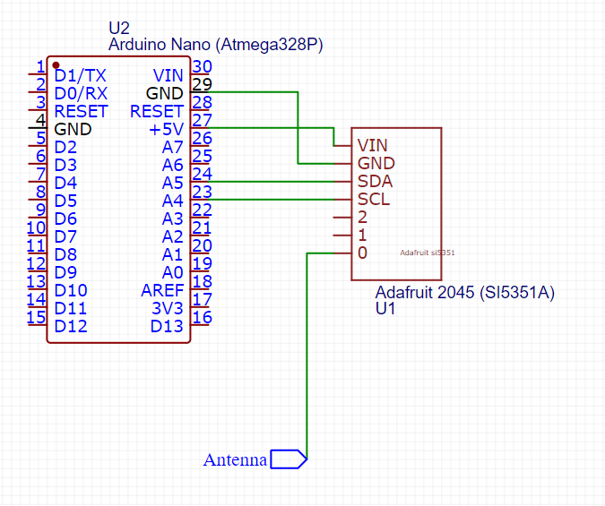

40mHz Submarine Controller
=======

This repository contains example code to control a 40mHz submarine like the one available through the following link:
[LSRC-332 Mini RC Onderzeeër](https://nl.aliexpress.com/item/1005005888269003.html)

# Software

## Carrier wave
The submarine used for this code uses a 40.680mHz carrier wave. Submarines of another type or bought on another date may use a
(slightly) different carrier wave. To verify the carrier wave, the delivered remote control can be taken apart. The correct frequency should be 
written on the frequency crystal in the remote control. 

For other carrier waves, the setup code for the SI5351 needs to be rewritten using the following guide: [Programming the SI5351](https://miscircuitos.com/clock-generator-si5351/). 

## IDE
The code can be openened in the Arduino IDE. Note that the library "Adafruit Si5351 Library" is needed. 

## Setup
### Components

- [Arduino Nano](https://nl.aliexpress.com/item/1005005967644175.html)
- [SI5351A (25mHz)](https://nl.aliexpress.com/item/4000040035169.html)

### Wiring

The above wiring diagram can be used to connect the components.
For the antenna, any piece of wire could be used. The antenna on the original remote control could also be connected in this place. 

## License
Boost Software License - Version 1.0 - August 17th, 2003

Permission is hereby granted, free of charge, to any person or organization
obtaining a copy of the software and accompanying documentation covered by
this license (the "Software") to use, reproduce, display, distribute,
execute, and transmit the Software, and to prepare derivative works of the
Software, and to permit third-parties to whom the Software is furnished to
do so, all subject to the following:

The copyright notices in the Software and this entire statement, including
the above license grant, this restriction and the following disclaimer,
must be included in all copies of the Software, in whole or in part, and
all derivative works of the Software, unless such copies or derivative
works are solely in the form of machine-executable object code generated by
a source language processor.

THE SOFTWARE IS PROVIDED "AS IS", WITHOUT WARRANTY OF ANY KIND, EXPRESS OR
IMPLIED, INCLUDING BUT NOT LIMITED TO THE WARRANTIES OF MERCHANTABILITY,
FITNESS FOR A PARTICULAR PURPOSE, TITLE AND NON-INFRINGEMENT. IN NO EVENT
SHALL THE COPYRIGHT HOLDERS OR ANYONE DISTRIBUTING THE SOFTWARE BE LIABLE
FOR ANY DAMAGES OR OTHER LIABILITY, WHETHER IN CONTRACT, TORT OR OTHERWISE,
ARISING FROM, OUT OF OR IN CONNECTION WITH THE SOFTWARE OR THE USE OR OTHER
DEALINGS IN THE SOFTWARE.